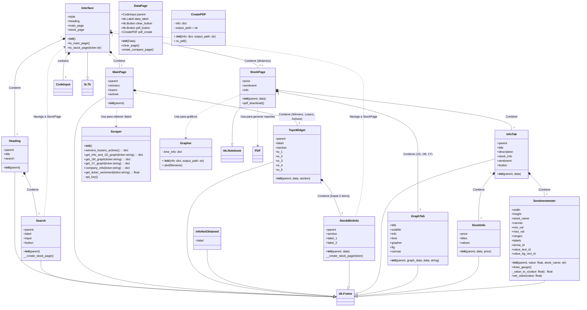

# _Stock-Dealer_


# AUTHORS

<h3 style="display: flex; align-items:center">

  
  
</h3>

# Stock-Dealer
With Stock Dealer you can get info and analyze common stocks, look at the most actives, top winners and losers, also get info from specific tickers. Look at the market sentiment and download a pdf report to take the data and use it as you want. *The proyect is in a early phase and may crash*

## How to use:
1. Download the repository
2. Go to https://www.alphavantage.co/support/#api-key and get 2 api keys
3. Create an .env on program's root and put the following info:
   ```
   BASE_URL=https://www.alphavantage.co/query?

   API_KEY_1=Your 1st api key
   API_KEY_2=Your 2nd api key
   ```
4. Activate your virtual enviroment (in case you have one)
   ```
   .\env\Scripts\activate
   ```
4. Execute the following command (be sure that you are on the program's folder)
   ```
   pip install -r requirements.txt
   ```
6. Run the main.py

##  By:
- [@AndrevLare](https://github.com/AndrevLare)
- [@Taizooavila](https://github.com/Taizooavila)
- [@daseb-xd](https://github.com/daseb-xd)

## Class Diagram:



