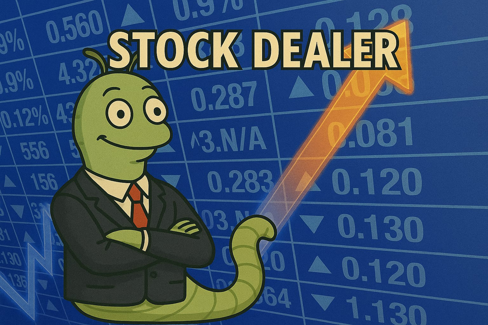

# _Stock-Dealer_ (POOyecto)



# AUTORES

<h3 style="display: flex; align-items:center">
<span>ㅤㅤ­­­­</span><span>ㅤㅤ­­­­</span>
  <span>ㅤㅤ­­­­</span><span>ㅤㅤ­­­­</span>
  
</h3>

## Diagrama de clases:


## Antes de empezar:

Hagan pull antes de empezar, asi si alguien cambió algo cuando no estaban,
actualizan su repositorio local y evitan encontrar conflictos cuando suben los
cambios. Comando:

```
git pull origin main
```

## Cada q terminen una caracteristica o quieran crear un "punto de guardado":

Cuando cambien cosas van a haber cambios sin guardar en el repo asi hayan
guardado el archivo, el guardado de archivos en el PC, guardado en el repo
local, y guardado en el repo remoto son cosas ditintas. tienen q hacer cada
una, para registrar los cambios en el local:

si crearon o borraron archivos:

```
git add .
git commit -a -m "mensaje descriptivo para el commit"
```

si solo modificaron:

```
git commit -a -m "mensaje descriptivo para el commit"
```

## Al terminar:

Cuando terminen de trabajar, tienen q subir sus cambios (su lista de commits
realizados) al repositorio remoto para que otros los puedan ver y usar, para
esto se hace push, esto lo q hace es añadir todos los commits realizados en
local a la lista de commits del repo remoto. Antes de hacer push asegurense
de hacer commit en todos sus cambios.

```
git push origin main
```

# Estructuras de datos usadas:

## Para winners-losers-actives:

obteniendo la data de forma:

```
Scrapper().winners_lossers_actives()
```

puedes acceder a las tres secciones de la forma:

```
# Ejemplo de uso

scrapper = Scrapper()

raw_data = scrapper.winners_losers_actives()


# Las 3 listas se acceden asi:

winners = raw_data.winners
losers = raw_data.losers
actives = raw_data.actives
```

Estos datos son listas de diccionarios, ejemplo de acceso:

```
if __name__ == "__main__":
    # Test
    scrap = Scraper()
    market_data = scrap.winners_lossers_actives()

    # Obtener datos de cada acción ganadora
    print("=== TOP GAINERS ===")
    for stock in market_data.winners:
        ticker = stock['ticker']
        price = stock['price']
        change_amount = stock['change_amount']
        change_percentage = stock['change_percentage']
        volume = stock['volume']

        print(f"Ticker: {ticker}")
        print(f"Precio: ${price}")
        print(f"Cambio: ${change_amount} ({change_percentage})")
        print(f"Volumen: {volume}")
        print("-" * 30)
```

## Para Obtener la info y valores de la accion de la compañia:

obteniendo la data de forma:

```
Scrapper().company_info(ticker)
```

puedes acceder a la info de la forma:

```
# Ejemplo de uso

scrapper = Scrapper()

data = scrapper.company_info(ticker)

data.key
```

Siendo "key" el nombre del valor al que quieres accesar, aqui un JSON de ejemplo de como se llaman todos los datos q llegan para el ticker IBM, no se van a mostrar todos, (ver PDF de GUI):

```
{
    "Symbol": "IBM",
    "AssetType": "Common Stock",
    "Name": "International Business Machines",
    "Description": "International Business Machines Corporation (IBM) is an American multinational technology company headquartered in Armonk, New York, with operations in over 170 countries. The company began in 1911, founded in Endicott, New York, as the Computing-Tabulating-Recording Company (CTR) and was renamed International Business Machines in 1924. IBM is incorporated in New York. IBM produces and sells computer hardware, middleware and software, and provides hosting and consulting services in areas ranging from mainframe computers to nanotechnology. IBM is also a major research organization, holding the record for most annual U.S. patents generated by a business (as of 2020) for 28 consecutive years. Inventions by IBM include the automated teller machine (ATM), the floppy disk, the hard disk drive, the magnetic stripe card, the relational database, the SQL programming language, the UPC barcode, and dynamic random-access memory (DRAM). The IBM mainframe, exemplified by the System/360, was the dominant computing platform during the 1960s and 1970s.",
    "CIK": "51143",
    "Exchange": "NYSE",
    "Currency": "USD",
    "Country": "USA",
    "Sector": "TECHNOLOGY",
    "Industry": "COMPUTER & OFFICE EQUIPMENT",
    "Address": "1 NEW ORCHARD ROAD, ARMONK, NY, US",
    "OfficialSite": "https://www.ibm.com",
    "FiscalYearEnd": "December",
    "LatestQuarter": "2025-03-31",
    "MarketCapitalization": "271356035000",
    "EBITDA": "13950000000",
    "PERatio": "49.99",
    "PEGRatio": "2.165",
    "BookValue": "28.92",
    "DividendPerShare": "6.68",
    "DividendYield": "0.0228",
    "EPS": "5.84",
    "RevenuePerShareTTM": "67.97",
    "ProfitMargin": "0.0871",
    "OperatingMarginTTM": "0.124",
    "ReturnOnAssetsTTM": "0.0447",
    "ReturnOnEquityTTM": "0.218",
    "RevenueTTM": "62832001000",
    "GrossProfitTTM": "35840000000",
    "DilutedEPSTTM": "5.84",
    "QuarterlyEarningsGrowthYOY": "-0.349",
    "QuarterlyRevenueGrowthYOY": "0.005",
    "AnalystTargetPrice": "258.02",
    "AnalystRatingStrongBuy": "2",
    "AnalystRatingBuy": "8",
    "AnalystRatingHold": "9",
    "AnalystRatingSell": "2",
    "AnalystRatingStrongSell": "1",
    "TrailingPE": "49.99",
    "ForwardPE": "26.6",
    "PriceToSalesRatioTTM": "4.319",
    "PriceToBookRatio": "10.1",
    "EVToRevenue": "5.1",
    "EVToEBITDA": "26.01",
    "Beta": "0.652",
    "52WeekHigh": "296.16",
    "52WeekLow": "169.32",
    "50DayMovingAverage": "265.83",
    "200DayMovingAverage": "240.9",
    "SharesOutstanding": "929397000",
    "SharesFloat": "927361000",
    "PercentInsiders": "0.119",
    "PercentInstitutions": "65.274",
    "DividendDate": "2025-06-10",
    "ExDividendDate": "2025-05-09"
}
```

## Dia, Mes y Año:

con las funciones get_info_and_1D_graph(), get_1M_graph() y get_1Y_graph()
podemos acceder al historico de valores de la accion, si no encuentra info,
se retorna None,

```
#ejemplo de uso

ticker = "AAPL"
day_info = scrap.get_info_and_1D_graph(ticker)

if day_info:
    print(f"Last Refreshed: {day_info.last_refreshed}")
    print(f"Current Value: {day_info.current_value}")
    print("Values:", day_info.values)

else:
    print("No data found for the ticker.")


month_info = scrap.get_1M_graph(ticker)

if month_info:
    print(f"Last Refreshed: {month_info.last_refreshed}")
    print("Values:", month_info.values)

else:
    print("No data found for the ticker.")


year_info = scrap.get_1Y_graph(ticker)

if year_info:
    print(f"Last Refreshed: {year_info.last_refreshed}")
    print("Values:", year_info.values)

else:
    print("No data found for the ticker.")
```
