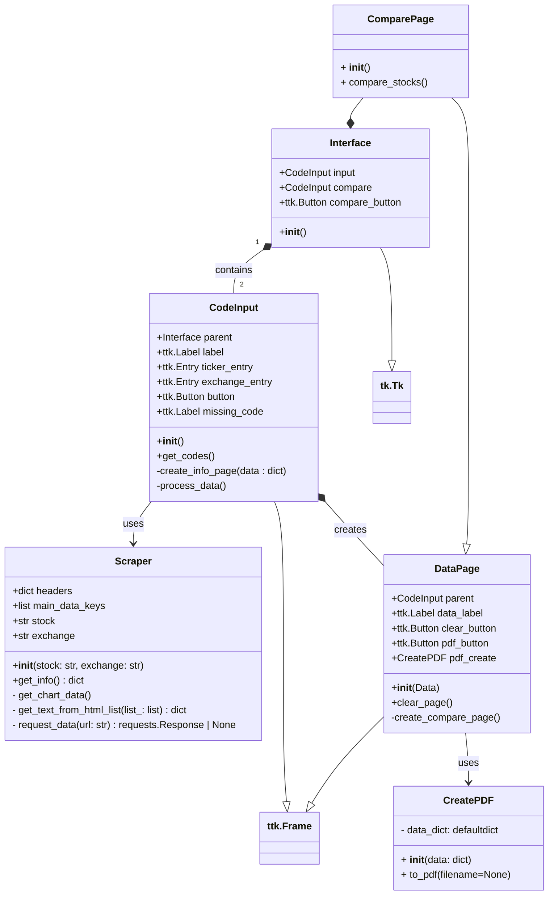

# _Stock-Dealer_ (POOyecto)

## AUTORES

<h3 style="display: flex; align-items:center">

  
  
</h3>

## Diagrama de clases:



## Antes de empezar:

Hagan pull antes de empezar, asi si alguien cambió algo cuando no estaban,
actualizan su repositorio local y evitan encontrar conflictos cuando suben los
cambios. Comando:

```
git pull origin main
```

## Cada q terminen una caracteristica o quieran crear un "punto de guardado":

Cuando cambien cosas van a haber cambios sin guardar en el repo asi hayan
guardado el archivo, el guardado de archivos en el PC, guardado en el repo
local, y guardado en el repo remoto son cosas ditintas. tienen q hacer cada
una, para registrar los cambios en el local:

si crearon o borraron archivos:

```
git add .
git commit -a -m "mensaje descriptivo para el commit"
```

si solo modificaron:

```
git commit -a -m "mensaje descriptivo para el commit"
```

## Al terminar:

Cuando terminen de trabajar, tienen q subir sus cambios (su lista de commits
realizados) al repositorio remoto para que otros los puedan ver y usar, para
esto se hace push, esto lo q hace es añadir todos los commits realizados en
local a la lista de commits del repo remoto. Antes de hacer push asegurense
de hacer commit en todos sus cambios.

```
git push origin main
```

## Estructuras de datos usadas:

Para winners-losers-actives:

obteniendo la data de forma:

```
Scrapper().winners_lossers_actives()
```

puedes acceder a las tres secciones de la forma:

```
# Ejemplo de uso

scrapper = Scrapper()

raw_data = scrapper.winners_losers_actives()


# Las 3 listas se acceden asi:

winners = raw_data.winners
losers = raw_data.losers
actives = raw_data.actives
```

Estos datos son listas de diccionarios, ejemplo de acceso:

```
if __name__ == "__main__":
    # Test
    scrap = Scraper()
    market_data = scrap.winners_lossers_actives()

    # Obtener datos de cada acción ganadora
    print("=== TOP GAINERS ===")
    for stock in market_data.winners:
        ticker = stock['ticker']
        price = stock['price']
        change_amount = stock['change_amount']
        change_percentage = stock['change_percentage']
        volume = stock['volume']

        print(f"Ticker: {ticker}")
        print(f"Precio: ${price}")
        print(f"Cambio: ${change_amount} ({change_percentage})")
        print(f"Volumen: {volume}")
        print("-" * 30)
```
