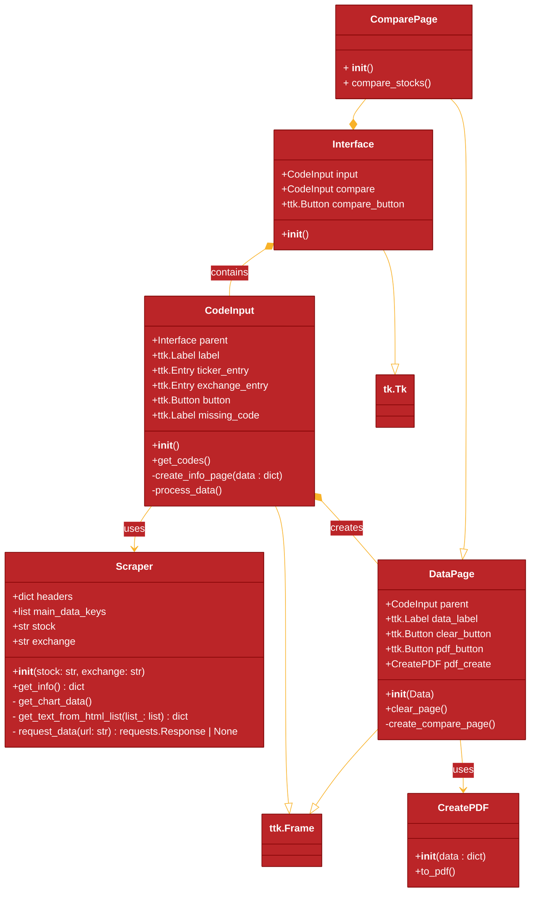

# Proyecto-POO

## Diagrama de clases:



Hola geis, aqui una git guia (guita):

## Antes de empezar:

Hagan pull antes de empezar, asi si alguien cambió algo cuando no estaban,
actualizan su repositorio local y evitan encontrar conflictos cuando suben los
cambios. Comando:

```
git pull origin main
```

## Cada q terminen una caracteristica o quieran crear un "punto de guardado":

Cuando cambien cosas van a haber cambios sin guardar en el repo asi hayan
guardado el archivo, el guardado de archivos en el PC, guardado en el repo
local, y guardado en el repo remoto son cosas ditintas. tienen q hacer cada
una, para registrar los cambios en el local:

si crearon o borraron archivos:

```
git add .
git commit -a -m "mensaje descriptivo para el commit"
```

si solo modificaron:

```
git commit -a -m "mensaje descriptivo para el commit"
```

## Al terminar:

Cuando terminen de trabajar, tienen q subir sus cambios (su lista de commits
realizados) al repositorio remoto para que otros los puedan ver y usar, para
esto se hace push, esto lo q hace es añadir todos los commits realizados en
local a la lista de commits del repo remoto. Antes de hacer push asegurense
de hacer commit en todos sus cambios.

```
git push origin main
```
